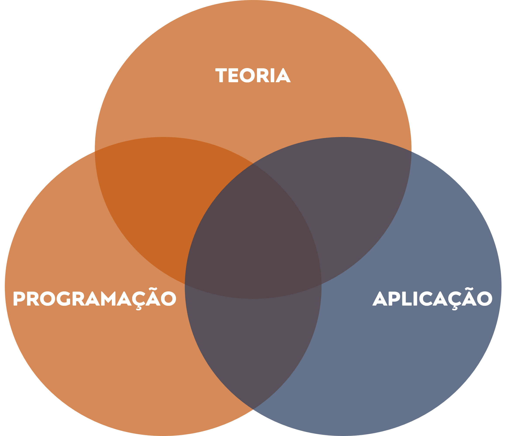

```{r setup, include=FALSE}
options(htmltools.dir.version = FALSE)
knitr::opts_chunk$set(
  fig.width=9, fig.height=3.5, fig.retina=3,
  out.width = "100%",
  cache = FALSE,
  echo = TRUE,
  message = FALSE, 
  warning = FALSE,
  hiline = TRUE
)
```

```{r xaringan-themer, include=FALSE, warning=FALSE}

xaringanthemer::style_mono_light(base_color = '#0A5632')
                                   
```

```{r ,echo=FALSE}

xaringanExtra::use_scribble()

xaringanExtra::use_search(show_icon = TRUE)

```

class: inverse, center, middle

# USE MÁSCARA!

```{r, echo = F, fig.align = 'center', fig.alt= 'Gif da série the office para apresentar a organização dos atendimentos ', out.width = '50%'}
knitr::include_graphics('https://media.giphy.com/media/6R2mLi910HL4VXFwOG/giphy.gif')
```

---
## APRESENTAÇÃO

- [**Qual o objetivo da aula?**](#objetivo_aula)

--

- [**Afinal, o que é uma amostra?**](#amostra_populacao)

--

- [**Tudo sempre depende?**](#dependencia)

--

- [**O que é probabilidade?**](#probabilidade)

--

- [**Sua hipótese é verdadeira?**](#teste_hipotese)

--

- [**Todo erro é igual?**](#erros)


---
class: inverse, center, middle 
name: objetivo_aula

# QUAL O OBJETIVO DA AULA?

```{r, echo = F, fig.align = 'center', fig.alt= 'Gif da série the office para apresentar o professor', out.width = '50%'}
knitr::include_graphics('https://media.giphy.com/media/UAHZijO91QCl2/giphy.gif')
```

---
<div style="text-align: justify">

## OBJETIVO DA AULA

Esta aula tem por objetivo principal **relembrar os principais conceitos 
estatísticos** que serão aprofundados ao longo de todo o curso. Nosso foco aqui
está em compreender a **"lógica de raciocínio de cada conceito" sem se apegar
aos "recursos matemáticos" necessários para aplicação prática das lógicas 
apresentadas**.

<br/>

O principal da aula é finalmente compreender que **estatística não "é conta"**, 
muito mais que isso, **é uma forma de enxergar o mundo**. A estatística é uma 
forma de tomar decisões consistentes, por sua vez, apoiadas em dados. Para tanto, 
foram desenvolvidas uma série de **"ferramentas matemáticas"** para analisar os 
dados. Aproveite este momento para refletir quantas vezes as suas decisões foram (ou 
ainda são) pautadas em expressões/raciocínios como "eu acho que...". Este é um 
percurso muito perigoso pois em grande parte das vezes nossa intuição pode nos 
levar ao erro!

<br/>

**OBS:** A partir da perspectiva acima deve-se sempre se ter em mente que a
matemática não passa de uma ferramenta que aprenderemos a usar, mas não é o 
objetivo final. Pelo menos não para nós que temos um foco aplicado!


---
<div style="text-align: justify">

## OBJETIVO DA AULA

Contudo, na segunda parte da aula de hoje continuaremos a discutir aspectos da 
programação em R. Consolidaremos alguns conceitos de programação vistos na última
aula e ainda avanceremos em mais alguns aspectos. 

<br/>

**OBS:** É importante ter em mente que o aprendizado em programação é facilitado 
quando estamos constantemente em contato com a programação. Sobre este aspecto 
uma dica pode te ajudar a se desenvolver: "é melhor estudar 10 minutos de 
programação ao dia, 6 vezes por semana, que estudar apenas uma 1 hora de 
programação em 1 dia da semana". Pratique/repita os conceitos de programação 
vistos em aula, um pouquinho por dia, todo dia!


---
<div style="text-align: justify">

## OBJETIVO DA AULA

```{r, echo = F, fig.align = 'center', out.width = '80%'}

```

---
class: inverse, center, middle 
name: amostra_populacao

# AFINAL, O QUE É UMA AMOSTRA?

```{r, echo = F, fig.align = 'center', fig.alt= 'Gif da série the office para apresentar o professor', out.width = '50%'}
knitr::include_graphics('https://media.giphy.com/media/cAxOGVNVPEkjDcpVQk/giphy.gif')
```

---
<div style="text-align: justify">

## AMOSTRA E POPULAÇÃO

Sempre que vamos explicar os conceitos de amostra e população partimos de um 
um exemplo útil: **Pesquisas de intenção de votos**, vamos a ele. Imagine que 
você faz parte da equipe de uma empresa de pesquisa de opinião pública que foi 
contratada para realizar uma previsão do resultado de uma eleição, como proceder?

<br/>

A única maneira de saber exatamente o resultado da eleição consiste em consultar
todos os eleitores e, ainda mais, obrigá-los a falar a real intenção de cada um. 
Não é necessário muito esforço para compreender que este procedimento é impossível:
 - Não há como consultar todos os eleitores;
 - Não há como obrigar ninguém a responder a real intenção de votos. 

<br/>

De todo modo, é possível contornar o primeiro problema, isto é, não é preciso 
consultar todos os eleitores. Pode-se, alternativamente, selecionar um conjunto 
de eleitores a serem consultados e, desde que este conjunto de eleitores seja 
representativo do todo, concluir que o resultado a pesquisa com o conjunto 
"é igual" ao resultado do todo.

---
<div style="text-align: justify">

## AMOSTRA E POPULAÇÃO

Na estatística nos referimos ao total de eleitores como **população** e ao 
conjunto de eleitores selecionados para pesquisa como **amostra**. De fato, a 
partir deste exemplo ilustrativo pode-se realizar uma definição mais geral sobre 
esses conceitos, assim como segue:

- **População:**  Total de elementos (ou eventos) semelhantes e que interessa para
alguma questão ou experimento;

- **Amostra:** Subconjunto de elementos (ou eventos) formados a partir da 
população, ou seja, subconjunto do total de elementos (ou eventos).

<br/>

É possível realizar mais uma definição a partir do exemplo da pesquisa de 
intenção de votos. Se você for um pouco mais observador poderá perceber que 
utilizamos uma amostra para "obter" uma conclusão acerca da população. Aqui, vamos 
chamar esta "conclusão sobre algum aspecto da população a partir do estudo de uma
amostra" de **inferência estatística**.


---
<div style="text-align: justify">

## AMOSTRA E POPULAÇÃO

Ilustração de um processo de amostragem:

```{r, echo = F, fig.align = 'center', out.width = '50%'}

```

--

**OBS:** Mais a frente discutiremos com maior profundidade os processos de 
amostragem ("como formar amostras a partir da população") de modo a aumentar as 
chances de que a amostra selecionada seja representativa da população.

---
<div style="text-align: justify">

## AMOSTRA E POPULAÇÃO

É importante ressaltar que quando estamos nos referindo à população, chamamos 
seus indicadores de parâmetros e, quando estamos nos referindo à amostra, 
chamamos seus indicadores de estatísticas. Vamos aos exemplos:

- **"A média de idade no Brasil é de 75 anos"**. Neste caso estamos avaliando toda a
**população** do Brasil, assim, a **média é um indicador sobre esta população** 
e, portanto, esta média pode ser chamada de **parâmetro**;

- **"A média de idade da amostra é de 73 anos"**. Neste caso estamos
avaliando uma **amostra da população** do Brasil, assim, a **média é um indicador
sobre esta amostra** e, portanto, esta média pode ser chamada de **estatística**.

<br/>

Infelizmente, na maior parte dos casos não sabemos quais são os parâmetros, ou 
seja, não sabemos exatamente os valores dos indicadores sobre a população. Mesmo 
assim, mais a frente discutiremos uma série de estratégias para 
obter conclusões consistentes a partir de amostras de dados selecionada, isto é, 
aprenderemos como realizar inferências estatísticas.

---
class: inverse, center, middle 
name: dependencia

# TUDO SEMPRE DEPENDE?

```{r, echo = F, fig.align = 'center', fig.alt= 'Gif da série the office para apresentar o professor', out.width = '50%'}
knitr::include_graphics('https://media.giphy.com/media/dEdmW17JnZhiU/giphy.gif')
```

---
<div style="text-align: justify">

## Variáveis Dependentes e Variáveis Independentes

Em alguns casos os estatísticos precisam monitorar algo que pode assumir
diferentes valores em determinadas circustâncias e, nesses casos, chamamos esse 
algo de **variável**. Estas variáveis podem ser agrupadas em dois tipos, conforme
apresentado abaixo:

- **Variável independente:** Variável que o pesquisador manipula durante a sua 
pesquisa;

- **Variável dependente:** Variável que o pesquisador mede ao ser alterada pela
manipulação da variável independente.

<br/>

É possível encontrar as duas variáveis em análises estatísticas e, em geral, os
pesquisadores estão interessantos em avaliar a relação entre as variáveis dependentes
e as variáveis independentes.

---
## Variáveis Dependentes e Independentes - Exemplo

```{r, echo = F, fig.align = 'center', out.width = '60%'}

```

--
- **Variável Independente:** O tipo de treinamento é manipulado pelo pesquisador;

- **Variável Dependente:** As notas dos estudantes são medidas pelo pesquisador 
após manipulação da variável independente.

---
class: inverse, center, middle 
name: probabilidade

# O QUE É PROBABILIDADE?

```{r, echo = F, fig.align = 'center', fig.alt= 'Gif da série the office para apresentar o professor', out.width = '50%'}
knitr::include_graphics('https://media.giphy.com/media/o75ajIFH0QnQC3nCeD/giphy.gif')
```

---
<div style="text-align: justify">

## RETOMANDO OS CONCEITOS

Para todas as conclusões que os estatísticos alcançam a partir das estratégias 
analíticas há um grau de confiança. Esse nível de confiança é expresso em termos
de probabilidade. 

<br/> 

Vamos retomar os conceitos já vistos. Vimos que em uma pesquisa eleitoral avaliamos
as intenções de votos a partir de uma **amostra** e, com base nos resultados da 
amostra, **inferimos** (concluimos) o resultado das eleições (resultado da 
**população**). O que estamos adicionando agora é que sabe-se que a amostra 
analisada pode não ser totalmente representativa da população e, portanto, há a 
necessidade de avaliar o **grau de confiança** do resultado obtido.

<br/>

Também devido a este fato deve-se ter em mente o conceito de probabilidade. De 
fato, a probabilidade não é apenas um conceito estatístico, ao contrário, há um 
extenso debate filosófico acerca do tema mas, mantendo nossa pretensão prática, 
sejamos sucintos.


---
<div style="text-align: justify">

## CONCEITO DE PROBABILIDADE

Sob uma perspectiva matemática, a **probabilidade** de um evento ocorrer é 
calculada a partir de uma razão entre o **número de vezes que um evento pode 
ocorrer** e o **número total de eventos possíveis**. Para facilitar a explicação 
deste conceito vamos buscar alguns exemplos amplamente utilizados nestes momentos:

- Ao lançar uma moeda não viciada, qual a probabilidade de cair cara?
  - **Número de vezes que o evento pode ocorrer** =  número de vezes que pode cair 
  cara (como a moeda tem um lado cara e um coroa, o número de vezes que pode cair 
  cara corresponde a um);
  
  - **Número total de eventos possíveis** = número de lados da moeda (o total de 
  eventos possíveis é igual a dois, cair cara, ou cair coroa);
  
  - Assim, a probabilidade de cair cara ao lançar uma moeda é igual a $1/2$ (
  ou 50%).

--

$$Probabilidade = \frac{Número \ de \ vezes \ que \ o \ evento\  pode \ ocorrer}{Número \ total \ de \ eventos \ possíveis} $$
---
class: inverse, center, middle 
name: probabilidade

# SUA HIPÓTESE É VERDADEIRA?

```{r, echo = F, fig.align = 'center', fig.alt= 'Gif da série the office para apresentar o professor', out.width = '50%'}
knitr::include_graphics('https://media.giphy.com/media/GfaZNzU42Snz6dlGhN/giphy.gif')
```


---
<div style="text-align: justify">

## Hipótese, Teste de Hipótese e Probabilidade

Sempre que um estatístico busca estudar algo (por exemplo, o impacto do 
"treinamento A" no desempenho escolar dos estudantes) ele o faz a partir de hipóteses. 
Isto é, ele faz uma afirmação sobre o caso estudado e, ao reunir os dados sobre o tema,
ele testa se a afirmação está correta.

- "afirmação sobre o caso estudado" (**hipótese**);

- "testa se a afirmação está correta" (**teste de hipótese**).

<br/>


Como dito anteriormente, a toda conclusão estatística está associada uma hipótese
e, assim, o próprio teste de hipótese é uma aplicação do conceito de probabilidade. 
Vamos entender este conceito a partir de um exemplo concreto (o mais simples de 
todos, o lançar de uma moeda).

---
<div style="text-align: justify">

## Hipótese, Teste de Hipótese e Probabilidade

Suponha que você possui uma moeda e queira avaliar se ela é viciada ou não. 

- **Tema estudado:** A fabricação da moeda (viciada ou não?);

- **Formulação da explicação (formulação da hipótese):** "A moeda não é viciada!";

- **Teste:** Lançar 100 vezes uma moeda e anotar o resultado do lançamento (cara ou coroa);

- **Probabilidade esperada:** Como sabemos, é esperado que metade das vezes o resultado
do lançamento seja cara e a outra metade das vezes seja coroa (devido às probabilidades
de ocorrência do evento cara, 50%, e coroa, 50%).

Suponha agora que ao realizar o teste (lançamento da moeda 100 vezes), você tenha 
obtido 99 caras e apenas 1 coroa. Qual seria a sua conclusão? Provavelmente, você
entenderá que a moeda é viciada. Mas qual foi o seu raciocínio para chegar a esta 
conclusão? Provavelmente foi: a probabilidade de ocorrência desses resultados é muito 
baixa ao se comparar com os resultados esperados. 


---
<div style="text-align: justify">

## TESTE DE HIPÓTESE

No exemplo anterior foi criada uma hipótese sobre a moeda, "ela não é viciada".
Em estatística isso é chamado de **hipótese nula** (em geral, denota-se $H_0$), 
isto é, uma hipótese inicial que supõe que não há nada fora do comum. Por seu turno,
associado a cada hipótese nula há uma **hipótese alternativa** (em geral, 
denota-se $H_1$), como contraponto à hipótese nula. 

<br/>

Pronto, a partir do exemplo anterior e destas definições de hipótese nula e 
hipótese alternativa você já aprendeu a lógica do raciocínio. Um teste de hipótese
consiste em perguntar **qual a probabilidade de se obter os resultados do teste 
dado que a hipótese nula é verdadeira**. Caso essa probabilidade seja muito baixa, 
você deve rejeitar a hipótese nula.  

<br/>

**Treine a formulação de hipóteses no exemplo dos treinamentos.**

---
class: inverse, center, middle 
name: erros

# TODO ERRO É IGUAL?
```{r, echo = F, fig.align = 'center', fig.alt= 'Gif da série the office para apresentar o professor', out.width = '50%'}
knitr::include_graphics('https://media.giphy.com/media/SZQBPO4NqHkh6wmdXk/giphy.gif')
```


---
<div style="text-align: justify">

##TPOS DE ERRO

Nada garante que a sua conclusão ao realizar um teste esteja certa. Mesmo que 
improvável, sempre há a possibilidade de ocorrência de um determinado evento e,
devido a isto, você pode acabar incorrendo em erros. No exemplo dos 100 
lançamentos da moeda, é possível que o resultado seja 99 caras e apenas 1 coroa 
e, ainda assim, a moeda não seja viciada.

<br/>

Assim, sempre é possível que uma determinada conclusão esteja errada. Mas os 
erros são diferentes:

- **Erro do Tipo I**: Ocorre quando se rejeita $H_0$ e não se deveria.

- **Erro do Tipo II**: Ocorre quando não se rejeita $H_0$ mas, se deveria.


---
class: inverse, center, middle


```{r, echo = F, fig.align = 'center', fig.alt= 'Gif para agradecer pela atenção e o tema é da série the office', out.width = '80%'}

knitr::include_graphics('https://media.giphy.com/media/n4oKYFlAcv2AU/giphy.gif')

```

